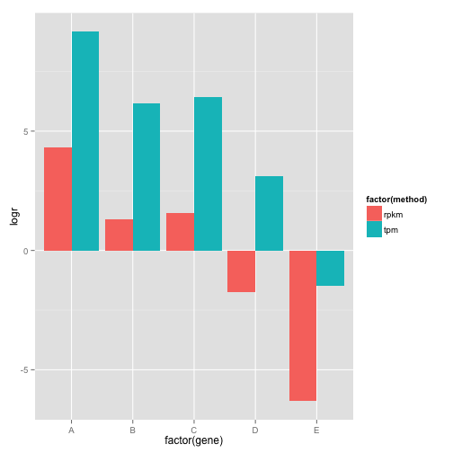

RPKM & TPM comparison
========================================================


```r
library(plyr)
```

```
## Warning: package 'plyr' was built under R version 3.1.3
```

```r
# Script to compare Reads per Kilobase per Million mapped reads (RPKM) to Transcripts per Million (TPM) for gene expression count data. Based on https://gist.github.com/johnstantongeddes/6925426

# Wagner et al. 2012 "Measurement of mRNA abundance using RNA-seq data: RPKM measure is inconsistent among samples" Theory Biosci. 131:281-285

## Worked example from http://blog.nextgenetics.net/?e=51
gene=c("A","B","C","D","E")
X <- data.frame(gene=gene, count=c(80, 10, 6, 3, 1),
                length=c(100, 50, 25, 5, 1))
X
```

```
##   gene count length
## 1    A    80    100
## 2    B    10     50
## 3    C     6     25
## 4    D     3      5
## 5    E     1      1
```

```r
Y <- data.frame(gene=gene, count=c(20, 20, 10, 50, 400),
                length=c(100, 50, 25, 5, 1))
Y
```

```
##   gene count length
## 1    A    20    100
## 2    B    20     50
## 3    C    10     25
## 4    D    50      5
## 5    E   400      1
```


```r
## Calculate RPKM

# RPKM = (Rg * 10^6) / (T * Lg)
# where
# Rg: number of reads mapped to a particular transcript g = count
# T = total number of transcripts sampled in run
# FLg: length of transcript g (kilobases)

RPKM <- function(Rg, Lg, T) {
  rpkm <- (Rg * 1e6)/(T * Lg)
  return(rpkm)
}

T <- sum(X$count)

RPKM(Rg=X$count[1],Lg=X$length[1],T=T)
```

```
## [1] 8000
```

```r
RPKM(Rg=X$count[2],Lg=X$length[2],T=T)
```

```
## [1] 2000
```

```r
RPKM(Rg=X$count[3],Lg=X$length[3],T=T)
```

```
## [1] 2400
```

```r
# Calculate RPKM using ddply
rpkm.X<-ddply(X, .(gene), summarize, rpkm = (count*1e6)/((sum(X$count)*length)))
rpkm.X
```

```
##   gene  rpkm
## 1    A  8000
## 2    B  2000
## 3    C  2400
## 4    D  6000
## 5    E 10000
```

```r
mean(rpkm.X$rpkm)
```

```
## [1] 5680
```

```r
rpkm.Y<-ddply(Y, .(gene), summarize, rpkm = (count*1e6)/((sum(Y$count)*length)))
rpkm.Y
```

```
##   gene  rpkm
## 1    A 4e+02
## 2    B 8e+02
## 3    C 8e+02
## 4    D 2e+04
## 5    E 8e+05
```

```r
mean(rpkm.Y$rpkm)
```

```
## [1] 164400
```

```r
## Calculate TPM

# TPM = (Rg * 10^6) / (Tn * Lg)
# where
# Tn = sum of all length normalized transcript counts

(Tn.X <- sum(ddply(X, .(gene), summarize, Tn = count/length)[2]))
```

```
## [1] 2.84
```

```r
TPM <- function(Rg, Lg, Tn) {
  tpm <- (Rg * 1e6)/(Tn * Lg)
  return(tpm)
}

TPM(Rg=X$count[1],Lg=X$length[1],Tn=Tn.X)
```

```
## [1] 281690.1
```

```r
TPM(Rg=X$count[2],Lg=X$length[2],Tn=Tn.X)
```

```
## [1] 70422.54
```

```r
TPM(Rg=X$count[3],Lg=X$length[3],Tn=Tn.X)
```

```
## [1] 84507.04
```

```r
# Great - corresonds to example results!

# Calculate RPKM using ddply
tpm.X <- ddply(X, .(gene), summarize, tpm = (count*1e6)/(Tn.X*length))
tpm.X
```

```
##   gene       tpm
## 1    A 281690.14
## 2    B  70422.54
## 3    C  84507.04
## 4    D 211267.61
## 5    E 352112.68
```

```r
mean(tpm.X$tpm)
```

```
## [1] 2e+05
```

```r
(Tn.Y <- sum(ddply(Y, .(gene), summarize, Tn = count/length)[2]))
```

```
## [1] 411
```

```r
tpm.Y <- ddply(Y, .(gene), summarize, tpm = (count*1e6)/(Tn.Y*length))
tpm.Y
```

```
##   gene        tpm
## 1    A    486.618
## 2    B    973.236
## 3    C    973.236
## 4    D  24330.900
## 5    E 973236.010
```

```r
mean(tpm.Y$tpm)
```

```
## [1] 2e+05
```

```r
#ratios
ratios = rbind (data.frame(method=rep("rpkm",5), gene=gene, logr=log2(rpkm.X$rpkm/rpkm.Y$rpkm)),
                data.frame(method=rep("tpm",5), gene=gene, logr=log2(tpm.X$tpm/tpm.Y$tpm)))
library(ggplot2)
```

```
## Warning: package 'ggplot2' was built under R version 3.1.3
```

```r
g = ggplot(ratios, aes(x=factor(gene), y=logr, fill=factor(method)))
g + geom_bar(position=position_dodge(), stat="identity")
```

 


